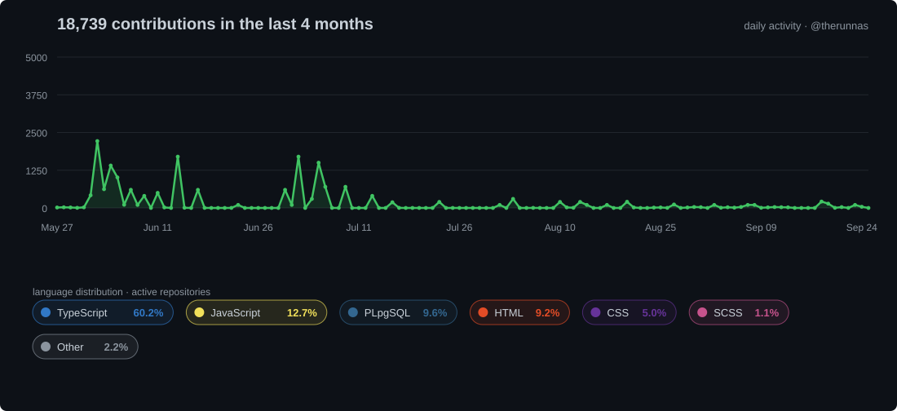
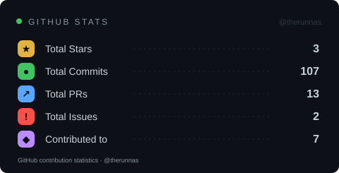
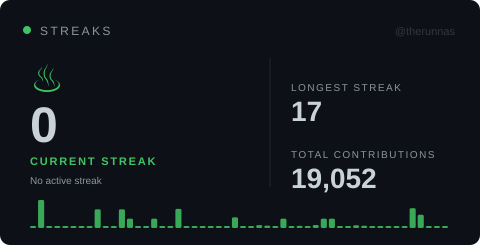

# Hi, I'm Runnas 👋

  My goal is to become a programmer capable of building complex systems,
  solving real-world problems, and taking on challenging projects.

---

---

## Activity

  

---

## GitHub Stats

  
  &nbsp;
  

---

## Contribution Overview

  

